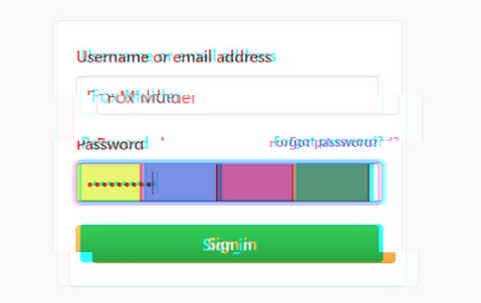

# Intercepted Visual Hash
Crypto

## Challenge 

	Description
	We were able to intercept Special Agent Fox Mulder when he was entering his credentials into the Pentagon Login Page. Are you able to crack his password for us? It seems he uses a google extension called Visual Hashing. 
	Here’s the link, Link 
	https://chrome.google.com/webstore/detail/visual-hashing/lkoelcpcjjehbjcchcbddggjmphfaiie

	Author: Syahiran
	
	Value
	500

## Solution

Visual Hashing source code

> [visualhash.js](visualhash.js)

> [util.js](util.js)

From the source code, these are the relevant functions

	// visualhash.js
    function updateVisualHash(elem) {
        if (elem.value == '' || elem != document.activeElement) {
            restoreBackgroundColor(elem);
            return;
        }
        var passwordHash = SHA1(elem.value);
        var elemWidth = Math.max(elem.clientWidth,elem.offsetWidth);
        var elemHeight = Math.max(elem.clientHeight,elem.offsetHeight);
        elem.style['backgroundImage'] = 'url(' + getDataURLForHash(passwordHash,elemWidth,elemHeight) + ')';
    }

    // util.js
	function randomizeHash(passwordHash) {
	    // Add a little bit of randomness to each byte
	    for (var byteIdx = 0; byteIdx < passwordHash.length/2; byteIdx++) {
	        var byte = parseInt(passwordHash.substr(byteIdx*2,2),16);
	        // +/- 3, within 0-255
	        byte = Math.min(Math.max(byte + parseInt(Math.random()*6)-3,0),255);
	        var hexStr = byte.toString(16).length == 2 ? byte.toString(16) : '0' + byte.toString(16);
	        passwordHash = passwordHash.substr(0,byteIdx*2) + hexStr + passwordHash.substr(byteIdx*2+2);
	    }
	    return passwordHash;
	}

    // util.js
	function getDataURLForHash(passwordHash,inputWidth,inputHeight) {
	    var win = window;
	    try {
	        win = unsafeWindow;   
	    }
	    catch(e) {}
	    var canvas = win.document.createElement('canvas');
	    canvas.height = inputHeight;
	    canvas.width = inputWidth;
	    var context = canvas.getContext('2d');
	    
	    passwordHash = randomizeHash(passwordHash);

	    for (var hashBandX = 0; hashBandX < 4; hashBandX++) {
	        context.fillStyle='#' + passwordHash.substr(hashBandX*6,6);
	        context.fillRect(hashBandX/4*inputWidth,0,inputWidth/4,inputHeight);
	        
	        context.fillStyle='#000000';
	        context.fillRect(((hashBandX+1)/4*inputWidth)-1,0,2,inputHeight);
	    }

	    context.strokeStyle='#000000';
	    context.strokeRect(0,0,inputWidth,inputHeight);

	    return canvas.toDataURL();
	}

1. updateVisualHash
	- Password goes through SHA1: `passwordHash = SHA1(elem.value)`

2. randomizeHash
	- Iterate through every hex pair (every 2 characters): `var byte = parseInt(passwordHash.substr(byteIdx*2,2),16);`
	- and add +/- 3 randomisation: `// +/- 3, within 0-255`

3. getDataURLForHash
	- The 4 colors are simply split up from the hash: `passwordHash.substr(hashBandX*6,6);`

### How to exploit

My technique is as follows:

1. Retrieve colors from the screenshot.
2. Concat the color code hex together. This will be our hash.
3. Bruteforce the input and compare to the hash
4. When comparing the input, make sure to allow for tolerance.

The password is 9 characters:

	NYP{xxxx}

So we need to bruteforce 4 characters, as we know the flag format.

Assume the input is alphanumeric only (upper/lowercase, and digits)

Using a color picker, we find the colors as follows...

	Yellow: #EDF482
	Blue: #7C92E0
	Red: #B766A0
	Green: #67947E

Note that the screenshot is JPG, which means there is compression of color.

I initially bruteforced with a tolerance of 3 which did not work, I increased it to 10 and 15 which still did not work.

A tolerance of 20 gave us the password.

	$ time python3 solve2.py 
	Success: NYP{H45h}

	real	0m42.729s
	user	0m41.125s
	sys	0m0.312s

Found Additional References:

- https://www.aperikube.fr/docs/inshack_2018/visual_hashing_hard/

## Flag

	NYP{H45h}
