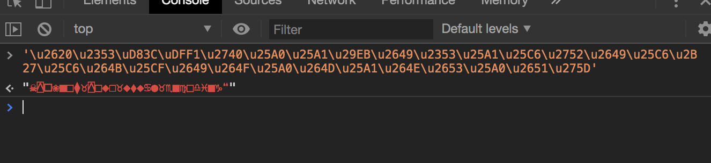
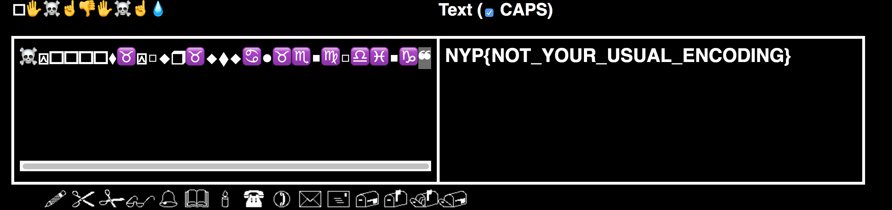

# Welcome to Uniqlo
Misc

## Challenge 

	Name
	Welcome to Uniqlo ✆︎
	Description
	Welcome to Unicode, this shirt has got a discount sale of 🗏︎📁︎ 🏱︎♏︎❒︎♍︎♏︎■︎⧫︎ 

	Author: Syahiran
	Value
	300

	%u2620%uFE0E%u2353%uFE0E%uD83C%uDFF1%uFE0E%u2740%uFE0E%u25A0%uFE0E%u25A1%uFE0E%u29EB%uFE0E%u2649%uFE0E%u2353%uFE0E%u25A1%uFE0E%u25C6%uFE0E%u2752%uFE0E%u2649%uFE0E%u25C6%uFE0E%u2B27%uFE0E%u25C6%uFE0E%u264B%uFE0E%u25CF%uFE0E%u2649%uFE0E%u264F%uFE0E%u25A0%uFE0E%u264D%uFE0E%u25A1%uFE0E%u264E%uFE0E%u2653%uFE0E%u25A0%uFE0E%u2651%uFE0E%u275D%uFE0E

## Solution

If we search some of the text, it seems to be converted from alphabet to Wingdings.

https://lingojam.com/WingdingsTranslator

Find a reverse converter

http://grompe.org.ru/static/wingdings_gaster.html

---

To input the text, convert it from URL to string escaped (replace % with `\`)

	/u2620/uFE0E/u2353/uFE0E/uD83C/uDFF1/uFE0E/u2740/uFE0E/u25A0/uFE0E/u25A1/uFE0E/u29EB/uFE0E/u2649/uFE0E/u2353/uFE0E/u25A1/uFE0E/u25C6/uFE0E/u2752/uFE0E/u2649/uFE0E/u25C6/uFE0E/u2B27/uFE0E/u25C6/uFE0E/u264B/uFE0E/u25CF/uFE0E/u2649/uFE0E/u264F/uFE0E/u25A0/uFE0E/u264D/uFE0E/u25A1/uFE0E/u264E/uFE0E/u2653/uFE0E/u25A0/uFE0E/u2651/uFE0E/u275D/uFE0E

Then remove `/uFE0E` as it is a modifying character in Unicode

https://codepoints.net/U+FE0E?lang=en

Now, we get this

	/u2620/u2353/uD83C/uDFF1/u2740/u25A0/u25A1/u29EB/u2649/u2353/u25A1/u25C6/u2752/u2649/u25C6/u2B27/u25C6/u264B/u25CF/u2649/u264F/u25A0/u264D/u25A1/u264E/u2653/u25A0/u2651/u275D

I parsed it in the Javascript console

Then get the flag

http://grompe.org.ru/static/wingdings_gaster.html

## Flag

	NYP{NOT_YOUR_USUAL_ENCODING}
